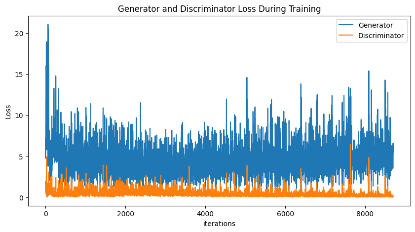
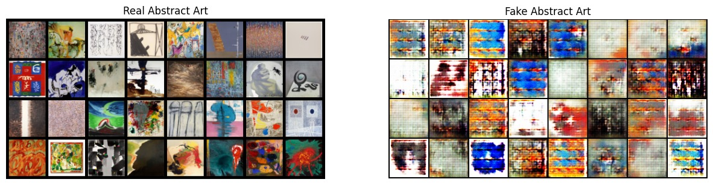
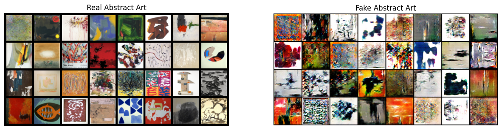

# wikiart-neural-trasnfer
## Author
Meng Chen
## Data Set
Abstract Art Gallery: 
https://www.kaggle.com/datasets/bryanb/abstract-art-gallery

It contains two folders Abstract_gallery and Abstract_gallery_2. Abstract_gallery folder contains 2782 images of abstract art while Abstract_gallery_2 contains 90 images. The images are in the JPG format and have a resolution of 256x256 pixels. I used the Abstract_gallery folder for training.

## Model
Abstract art has always been an intriguing topic for art lovers and researchers. In this first solution, I used a Deep Convolutional Generative Adversarial Network (DCGAN) model for generating abstract art.

Our DCGAN model consists of a generator and a discriminator. 

### Generator

The generator takes a random noise vector as input and generates a 2D image as output.

The architecture of the generator is shown in the following image:

The generator consists of four transposed convolutional layers followed by a `Tanh` activation function. Each transposed convolutional layer increases the spatial resolution of the input by a factor of two.

I use Adam optimizer with a learning rate of 0.0002 and a momentum of 0.5. The loss function used in our model is the binary cross-entropy loss.

### Discriminator

The discriminator is a binary classifier that takes an image as input and outputs a probability indicating whether the input is real or fake. Both the generator and discriminator are composed of several convolutional and transposed convolutional layers.

The discriminator consists of four convolutional layers followed by a sigmoid activation function. Each convolutional layer decreases the spatial resolution of the input by a factor of two. The loss function used in our model is the binary cross-entropy loss. I also used the Adam optimization algorithm with a learning rate of 0.0002 and a momentum of 0.5 for optimizing the discriminator.

The binary cross-entropy loss measures the difference between the predicted output and the true output. The loss function of the generator is defined as:

$L = -{(y\log(p) + (1 - y)\log(1 - p))}$

where $y$ is the true output, $p$ is the predicted output, and $y$ and $p$ are both scalars. The generator aims to minimize this loss function to generate images that can fool the discriminator.

The loss function of the discriminator is defined as:

$L_D = -\log(D(x)) - \log(1 - D(G(z)))$

where $x$ is a real image, and $D(x)$ is the output of the discriminator for the real image. The discriminator aims to maximize this loss function to correctly classify real and fake images.

During training, the generator and discriminator are trained iteratively. The generator generates fake images, and the discriminator classifies the real and fake images. The gradients of the loss functions with respect to the parameters of the generator and discriminator are computed, and the parameters are updated accordingly.

## Evaluation
We can evaluate the performance of our model by monitoring the loss values during training. Ideally, we want to see a decrease in the loss values over time, which indicates that the generator and discriminator are improving.

The loss values of the first iteration are $Loss(D)$: 1.9443	$Loss(G)$: 6.4855 and the loss values of the last iteration are $Loss(D)$: 0.1673	$Loss(G)$: 4.2439. We can see that the loss values of the generator and discriminator are decreasing over time, which indicates that the generator and discriminator are improving. Howevver, the loss value occilates a lot from the 1000th iterations and does not decrease significantly after that. This is probably because the generator and discriminator are not able to learn from each other.

Another way to evaluate the performance of our model is to generate some images and visually inspect them. We can also use the discriminator to classify the generated images as real or fake. Ideally, we want to see that the discriminator classifies the generated images as real.

After 50 epochs, the images generated by our model look like this, which is not very ideal:

After 100 epochs, the images generated by our model look like this, which is better than the previous one and have more artistic features:

## Future Work
In the next step, I will try to use a different model, such as a Variational Autoencoder (VAE) model, to generate abstract art.

We can also use a different dataset, such as the WikiArt dataset, to train our model. WikiArt is a large dataset of paintings from different artists. It contains 50,000 images of paintings in the JPG format and have a resolution of 256x256 pixels. We can use this dataset to train our model and generate paintings of other styles.

In terms of evaluation, we can use a different metric, such as the inception score, to evaluate the performance of our model.

## Reference
[1] https://arxiv.org/pdf/1511.06434v2.pdf

