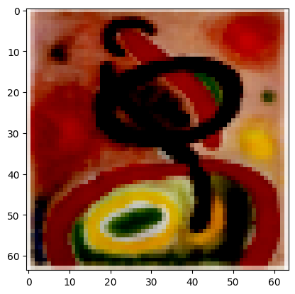

# wikiart-neural-trasnfer
## Author
Meng Chen

## Introduction
This project aims to create new style abstract art based on neural-network-based models. I used 2 different models to generate abstract art: Deep Convolutional Generative Adversarial Network (DCGAN), Variational Autoencoder (VAE). I also used a Neural Style Transferto create a combination of the style of abstract art and the content of either a painting or an image.

## Data Set
Abstract Art Gallery: 
https://www.kaggle.com/datasets/bryanb/abstract-art-gallery

It contains two folders Abstract_gallery and Abstract_gallery_2. Abstract_gallery folder contains 2782 images of abstract art while Abstract_gallery_2 contains 90 images. The images are in the JPG format and have a resolution of 256x256 pixels. I used the Abstract_gallery folder for training.

Neural Transfer:
It contains content images for neural transfer, including starry night, mona lisa and a potrait of myself.

## How to run
Required package: `pytorch, numpy, pandas, matplotlib, PIL, torchvision, tqdm, IPython`

Code: `GAN_model.ipynb`, `VAE_model.ipynb`, `VAE_model_new.ipynb`, `neural_transfer.ipynb`

For each model, there is a variable called `mode` which can be set to get data from google drive or local folder. If you want to run the code locally, set `mode` to `local`. If you want to run the code on google colab, set `mode` to `google drive`.

To run the code, simply run all the cells in the notebook.

## GAN Model
Abstract art has always been an intriguing topic for art lovers and researchers. In this first solution, I used a Deep Convolutional Generative Adversarial Network (DCGAN) model for generating abstract art.

Our DCGAN model consists of a generator and a discriminator. \[2\]

### Generator

The generator takes a random noise vector as input and generates a 2D image as output. (Code: `GAN_model.ipynb`) 

The architecture of the generator is shown in the following image:

The generator consists of four transposed convolutional layers followed by a `Tanh` activation function. Each transposed convolutional layer increases the spatial resolution of the input by a factor of two.

I use Adam optimizer with a learning rate of 0.0002 and a momentum of 0.5. The loss function used in our model is the binary cross-entropy loss.

### Discriminator

The discriminator is a binary classifier that takes an image as input and outputs a probability indicating whether the input is real or fake. Both the generator and discriminator are composed of several convolutional and transposed convolutional layers.

| Layer Type | Output Shape | Kernal Size | Stride | Padding |Activation |
|:-----|:--------:|------:| ------:| ------:| ------:|
| Convolution | 32x3x64 | 4x4 | 2 | Same | LeakyReLU |
| Convolution | 16x16x128 | 4x4 | 2 | Same | LeakyReLU |
| Batch Normalization | 16x16x128 | - | - | - | - |
| Convolution | 8x8x256 | 4x4 | 2 | Same | LeakyReLU |
| Batch Normalization | 8x8x256 | - | - | - | - |
| Convolution | 4x4x512 | 4x4 | 2 | Same | LeakyReLU |
| Batch Normalization | 4x4x512 | - | - | - | - |
| Convolution | 1x1x1 | 4x4 | 1 | Valid | Sigmoid |

The discriminator consists of four convolutional layers followed by a sigmoid activation function. Each convolutional layer decreases the spatial resolution of the input by a factor of two. The loss function used in our model is the binary cross-entropy loss. I also used the Adam optimization algorithm with a learning rate of 0.0002 and a momentum of 0.5 for optimizing the discriminator.

### Loss Function
The binary cross-entropy loss measures the difference between the predicted output and the true output. The loss function of the generator is defined as:

$L = -{(y\log(p) + (1 - y)\log(1 - p))}$

where $y$ is the true output, $p$ is the predicted output, and $y$ and $p$ are both scalars. The generator aims to minimize this loss function to generate images that can fool the discriminator.

The loss function of the discriminator is defined as:

$L_D = -\log(D(x)) - \log(1 - D(G(z)))$

where $x$ is a real image, $G(z)$ is the generated image, and $D(x)$ is the output of the discriminator for the real image. The discriminator aims to maximize this loss function to correctly classify real and fake images.

During training, the generator and discriminator are trained iteratively. The generator generates fake images, and the discriminator classifies the real and fake images. The gradients of the loss functions with respect to the parameters of the generator and discriminator are computed, and the parameters are updated accordingly.

### Evaluation
We can evaluate the performance of our model by monitoring the loss values during training. Ideally, we want to see a decrease in the loss values over time, which indicates that the generator and discriminator are improving.

The loss values of the first iteration are $Loss(D)$: 1.9443	$Loss(G)$: 6.4855 and the loss values of the last iteration are $Loss(D)$: 0.1673	$Loss(G)$: 4.2439. We can see that the loss values of the generator and discriminator are decreasing over time, which indicates that the generator and discriminator are improving. Howevver, the loss value occilates a lot from the 1000th iterations and does not decrease significantly after that. This is probably because the generator and discriminator are not able to learn from each other.

Another way to evaluate the performance of our model is to generate some images and visually inspect them. We can also use the discriminator to classify the generated images as real or fake. Ideally, we want to see that the discriminator classifies the generated images as real.

After 50 epochs, the images generated by our model look like this, which is not very ideal. There are some foggy noise in the images and some grid-like patterns.

After 100 epochs, the images generated by our model look like this, which is better than the previous one and have more artistic features. It has artistic strokes, reasonable color distribution, and some abstract patterns.

I juxatposed the generated images with the real images and recruited 10 friends to rate the generated images. If the generated images are convincing, the rating should be close to 5. If the generated images are not convincing, the rating should be close to 1. The average rating of the generated images is 3.9, which is decent but not great. More training epochs and better hyperparameters may improve the performance of our model.

I tried 2 different architectures for the encoder and decoder.

## Variational Autoencoder Model (VAE)
In this second solution, I used a Variational Autoencoder (VAE) model for generating abstract art. The architecture of the VAE model is shown in the following image[3]:

VAE is a generative model that can generate new images by sampling from a latent space. It consists of an encoder and a decoder. The encoder takes an image as input and outputs a latent vector. The decoder takes the latent vector as input and generates an image. The VAE model is trained to minimize the reconstruction loss between the input image and the generated image. The latent vector is sampled from a normal distribution with zero mean and unit variance. The latent vector can be used to generate new images by sampling from the normal distribution.

### Loss Function
The loss function of the VAE model consists of two parts: the reconstruction loss and the KL divergence loss. The reconstruction loss measures the difference between the input image and the generated image. I used the mean squared error (MSE) loss as the reconstruction loss.

$L_{recon} = \frac{1}{N}\sum_{i=1}^{N}(x_i - \hat{x_i})^2$

where $x_i$ is the input image, $\hat{x_i}$ is the generated image, and $N$ is the number of images in the training set.

The KL divergence loss measures the difference between the latent vector and the normal distribution. The loss function of the VAE model is defined as:

$L = L_{recon} + \beta KL$

where $\beta$ is a hyperparameter that controls the weight of the KL divergence loss. The KL divergence loss is defined as:

$KL = -\frac{1}{2}\sum_{i=1}^{N}(1 + \log(\sigma_i^2) - \mu_i^2 - \sigma_i^2)$

where $\mu_i$ and $\sigma_i$ are the mean and standard deviation of the latent vector, respectively.

### Architecture 1
The first architecture is insprired by the VAE model proposed by Diederik P Kingma and Max Welling [4]. (Code: `VAE_model.ipynb`)  The input image size is 64x64x3; batch size is 100; the latent vector size is 100; the number of epochs is 100; the learning rate is 0.0002; the $\beta$ value is 0.5; the optimizer is Adam; the loss function is MSE loss.

#### Encoder
The encoder takes an image as input and outputs a latent vector. The architecture of the encoder is shown in the following image:
| Layer Type | Output Shape | Kernal Size | Stride | Padding |Activation |
|:-----|:--------:|------:| ------:| ------:| ------:|
| Convolution | 32x32x32 | 3x3 | 2 | Same | LeakyReLU |
| Batch Normalization | 16x16x128 | - | - | - | - |
| Convolution | 16x16x64 | 3x3 | 2 | Same | LeakyReLU |
| Batch Normalization | 16x16x64 | - | - | - | - |
| Convolution | 8x8x128 | 3x3 | 2 | Same | LeakyReLU |
| Batch Normalization | 8x8x128 | - | - | - | - |
| Convolution | 4x4x256 | 3x3 | 2 | Same | LeakyReLU |
| Batch Normalization | 4x4x256 | - | - | - | - |
| Convolution | 2x2x512 | 3x3 | 2 | Same | LeakyReLU |
| Batch Normalization | 2x2x512 | - | - | - | - |
| Flatten | 2048 | - | - | - | - |

### Decoder
| Layer Type | Output Shape | Kernal Size | Stride | Padding | Output Padding | Activation |
|:-----|:--------:|------:| ------:| ------:| ------:| ------:|
| Transposed Convolution | 2x2x512 | 3x3 | 2 | Same | 1 | LeakyReLU |
| Batch Normalization | 2x2x512 | - | - | - | - | - |
| Transposed Convolution | 4x4x256 | 3x3 | 2 | Same | 1 | LeakyReLU |
| Batch Normalization | 4x4x256 | - | - | - | - | - |
| Transposed Convolution | 8x8x128 | 3x3 | 2 | Same | 1 | LeakyReLU |
| Batch Normalization | 8x8x128 | - | - | - | - | - |
| Transposed Convolution | 16x16x64 | 3x3 | 2 | Same | 1 | LeakyReLU |
| Batch Normalization | 16x16x64 | - | - | - | - | - |
| Transposed Convolution | 32x32x32 | 3x3 | 2 | Same | 1 | LeakyReLU |
| Batch Normalization | 32x32x32 | - | - | - | - | - |
| Transposed Convolution | 64x64x32 | 3x3 | 2 | Same | 1 | LeakyReLU |
| Batch Normalization | 64x64x32 | - | - | - | - | - |
| Convolution | 64x64x3 | 3x3 | 1 | Same | - | Tanh |

### Architecture 2

The second architecture is insprired by the VAE model proposed by Tuan Le [4]. (Code: `VAE_model_new.ipynb`) The input image size is 128x128x3; batch size is 100; the latent vector size is 100; the number of epochs is 10; the learning rate is 0.0002; the $\beta$ value is 0.5; the optimizer is Adam; the loss function is MSE loss.

#### Encoder
Encoder takes an image as input and outputs a latent vector. It consists of 5 convolutional layers, 5 max pooling layers, and 5 batch normalization layers. 
Input: 128x128x3
| Layer Type | Output Shape | Kernal Size | Stride | Padding |Activation |
|:-----|:--------:|------:| ------:| ------:| ------:|
| Convolution | 128x128x256 | 3x3 | 1 | Same | ReLU |
| Max Pooling | 64x64x256 | 2x2 | - | - | - |
| Batch Normalization | 64x64x256 | - | - | - | - |
| Convolution | 64x64x128 | 3x3 | 1 | Same | ReLU |
| Max Pooling | 32x32x128 | 2x2 | - | - | - |
| Batch Normalization | 32x32x128 | - | - | - | - |
| Convolution | 32x32x64 | 3x3 | 1 | Same | ReLU |
| Max Pooling | 16x16x64 | 2x2 | - | - | - |
| Batch Normalization | 16x16x64 | - | - | - | - |
| Convolution | 16x16x32 | 3x3 | 1 | Same | ReLU |
| Max Pooling | 8x8x32 | 2x2 | - | - | - |
| Batch Normalization | 8x8x32 | - | - | - | - |
| Convolution | 8x8x16 | 3x3 | 1 | Same | ReLU |
| Max Pooling | 4x4x16 | 2x2 | - | - | - |
| Batch Normalization | 4x4x16 | - | - | - | - |

#### Decoder
The decoder takes a latent vector as input and outputs an image. It consists of 5 transposed convolutional layers, 10 batch normalization layers, and 6 convolutional layer.
Input: 4x4x16
| Layer Type | Output Shape | Kernal Size | Stride | Padding | Output Padding | Activation |
|:-----|:--------:|------:| ------:| ------:| ------:| ------:|
| Convolution | 4x4x16 | 3x3 | 1 | Same | - | ReLU |
| Batch Normalization | 4x4x16 | - | - | - | - | - |
| Transposed Convolution | 8x8x32 | 3x3 | 2 | Same | 1 | ReLU |
| Batch Normalization | 8x8x32 | - | - | - | - | - |
| Convolution | 8x8x32 | 3x3 | 1 | Same | - | ReLU |
| Batch Normalization | 8x8x32 | - | - | - | - | - |
| Transposed Convolution | 16x16x64 | 3x3 | 2 | Same | 1 | ReLU |
| Batch Normalization | 16x16x64 | - | - | - | - | - |
| Convolution | 16x16x64 | 3x3 | 1 | Same | - | ReLU |
| Batch Normalization | 16x16x64 | - | - | - | - | - |
| Transposed Convolution | 32x32x128 | 3x3 | 2 | Same | 1 | ReLU |
| Batch Normalization | 32x32x128 | - | - | - | - | - |
| Transposed Convolution | 64x64x256 | 3x3 | 2 | Same | 1 | ReLU |
| Batch Normalization | 64x64x256 | - | - | - | - | - |
| Transposed Convolution | 128x128x64 | 3x3 | 2 | Same | 1 | Tanh |
| Batch Normalization | 128x128x64 | - | - | - | - | - |
| Convolution | 128x128x32 | 3x3 | 1 | Same | - | ReLU |
| Batch Normalization | 128x128x32 | - | - | - | - | - |
| Convolution | 128x128x16 | 3x3 | 1 | Same | - | ReLU |
| Batch Normalization | 128x128x16 | - | - | - | - | - |
| Convolution | 128x128x3 | 3x3 | 1 | Same | - | Sigmoid |

### Evaluation
Initially, I divided the data set into training set (90%) and test set (10%). I intend to test the quality of the generated images by comparing the generated images with the test set. I also have a random noise generator to generate random noise images to test the quality of the generated images. However,Both architecture didn't work very well. The generated images are very blurry so the evaluation methods didn't really work out. 

TO improve the performance, I tuned various hyperparameters: batch size 32/100; the latent vector size is 100/200; the number of epochs is 20/50/100; the learning rate is 0.0001/0.0002/0.0003 for architecture 1. However, none of these hyperparameters can generate a good result. The generated images are brown noises with some grid lines. 

| Original Image | Epoch 20 Times | Epoch 50 Times | Epoch 100 Times |
|:-----:|:--------:|:------:| :------:|
|  |  |  | 

Loss vs Epochs for architecture 1:

Loss decreases drastically in the first 10 epochs and then decreases slowly. It bumps up and down after 50 epochs, which suggests a possible saddle point.

For architecture 2, the CNN model is very deep so the training process is very slow. It takes ~15min to train 1 epoch. Due to limit computing resources, I only trained 10 epoch and the output is full of gray with a few green clusters.

Loss vs Epochs for architecture 2:

Loss decreases drastically in the first 50 iterations and then decreases slowly. It bumps up and down afterwards, which suggests a possible saddle point.

I juxatposed the generated images with the real images and recruited 10 friends to rate the generated images. If the generated images are convincing, the rating should be close to 5. If the generated images are not convincing, the rating should be close to 1. The average rating of the generated images is 1.7, which is not convincing.

Architecture 1 is designed for fake human face generation. It is possible that the model is not suitable for generating abstract art. Yet, only after more hyperparameter tuning can we draw a conclusion.

Tuan Le used architecture 2 to generate Japanese art and didn't receive a relative satisfying result until 22000 epochs. Apparently, 10 epoches is not enough for architecture 2 to learn the features of the dataset. More computing resources are needed to validate the performance of architecture 2.

I may also use VGG19 to extract the features of the images and use the features as the input of the decoder instead of designing encoder and decoder by myself.

## Neural Transfer Model
Neural Transfer allows me to take an image and reproduce it with a new artistic style. The algorithm takes three images, an input image, a content-image, and a style-image, and changes the input to resemble the content of the content-image and the artistic style of the style-image. \[4\] (Code: `Neural_Transfer_Model.ipynb`) 

To extract the features of the pictures, I use a pre-trained VGG19 model. A bpre-trained model is helpful in facilitating the training process. I choose one picture from the abstract art gallery dataset as the style image and a picture from the WikiArt dataset as the style image and pictures from Neural Style Transfer folder (starry night, mona lisa, and a potrait of myself) as the content images. I resize the images in the Abstract Art Gallery dataset to 64x64 pixels.

The architecture of the Neural Transfer Model[7]: 

     

### VGG19 Model
VGG19 is a convolutional neural network that consists of 16 convolutional layers and 3 fully connected layers. The convolutional layers are commonly used to extract features from the input image. The fully connected layers are used to classify the input image. The VGG19 model is trained on the ImageNet dataset, which contains 1.2 million images. I directly used the pre-trained VGG19 model as it has already learned to extract features from images.
The architecture of the VGG19 model is shown in the following image [8]: 

### Loss Function
The loss function of the neural style transfer model is the weighted sum of the content loss and the style loss. I tuned the weights of the content loss and the style loss to get the best results. With higher weights on the content loss, the generated image will be more similar to the content image. With higher weights on the style loss, the generated image will be more similar to the style image. I summarized the weights for generating the best results in the evaluation section.

$L_{total}(S,C,G) = \beta L_{content}(C,G) + \alpha L_{style}(S,G)$

The content loss is the mean squared error between the feature maps of the input image and the feature maps of the content image. 

$`L_{content}(C,G) = \sum_{l}\sum_{i,j} (m_l(C)_{ij} - m_l(G)_{ij})^2`$

The style loss is the mean squared error between the Gram matrix of the feature maps of the input image and the Gram matrix of the feature maps of the style image.

$`L_{style}(S,G) = \frac{1}{4n^2m^2}\sum_{l}\sum_{i,j} (G_l(S)_{ij} - G_l(G)_{ij})^2`$

### Evaluation
I tested 3 different style images and 3 different content images. The results are shown in the following images.
| Abstract Art No. | Style | Input | Output | Content Weight | Style Weight | Content Loss | Style Loss | Epochs | 
|:-----:|:--------:|:------:| :------:| :------:| :------:| :------:| :------:| :------:|
| 30 |  |  |  | 1 |1000000 | 38.725903 | 29.397888 | 300
| 14 |  |  |  | 5 |100000 | 196.481659 | 18.428104 | 300
| 26 |  |  |  | 10 |1000000 | 362.762299 | 57.876976 | 300

To evaluate the performance of the model, I used the content loss and the style loss as the evaluation metrics. The losses ends the minimum at the end of the epoch. It is noticeable that the content loss increases when the content image become more concrete (a real-life photo) as the corresponding content weight increases. For abstract art content images, it is relatively to transfer the abstract art style while keeping the original content. The style loss lies in a reasonable range in all three cases. I asked 10 people to evaluate the generated images. The mona lisa image has the highest score (8.5/10) while the potrait image has the lowest score (7/10) since the network transfers too much style from the style image that blurs the content. The starry night image has a score of 8.2/10.

## Discussion and Future Work
In general, GAN model generates satisfying results. VAE model fails to generate abstract art. Neural Transfer model successfully transfers the style of the style image to the content image. However, there are some rooms for improvement.

One way to improve the performance of my models is to train the model for more epochs. However, the training time is very long with current limited hardware.

Abstract art is not a well-defined concept as various artists have different styles, which may account for the hardness of training a model. WikiArt is a large dataset of paintings from different artists. It contains 50,000 images of paintings in the JPG format and have a resolution of 256x256 pixels. It has 27 categories of paintings. Categories like potrait, landscape are easier to find common features which may help the model to successfully generate images.
## Reference
[1] https://arxiv.org/pdf/1511.06434v2.pdf

[2] https://developers.google.com/machine-learning/gan/gan_structure?hl=zh-cn

[3] https://learnopencv.com/variational-autoencoder-in-tensorflow/

[4] https://arxiv.org/abs/1312.6114

[6] https://github.com/tuanle618/deepArt-generation/tree/master

[6] https://arxiv.org/abs/1508.06576

[7] https://www.v7labs.com/blog/neural-style-transfer

[8] https://www.researchgate.net/figure/VGG-19-Architecture-39-VGG-19-has-16-convolution-layers-grouped-into-5-blocks-After_fig5_359771670

## License
[MIT License](https://choosealicense.com/licenses/mit/)
